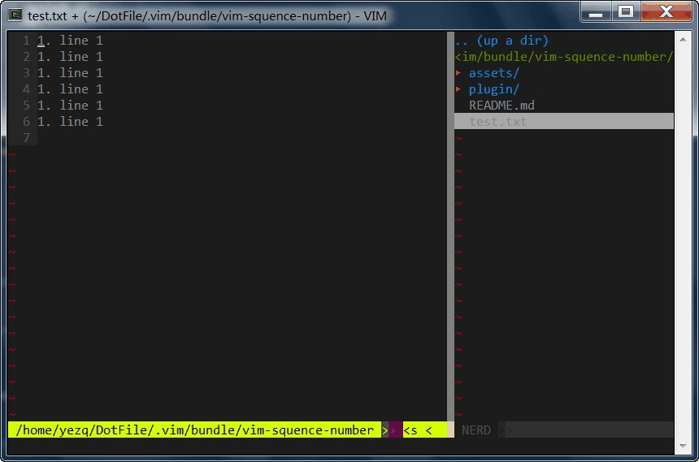

### About
small script to make the numbers in the selection texts become sequential

### Demo

### Usage
:SeqNumber [start value] [step value]

* :SeqNumber 1 1
* :SeqNumber . 1 *(if start value is '.', it mean base on value in each position)*

